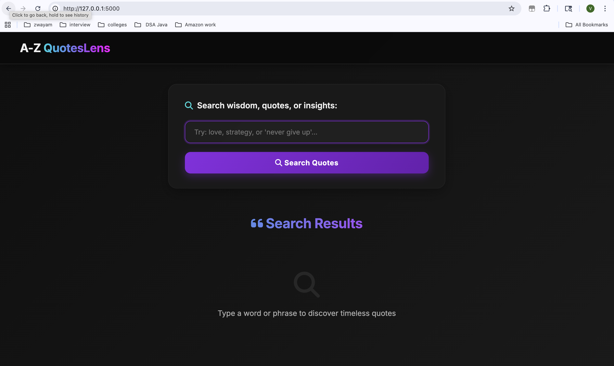
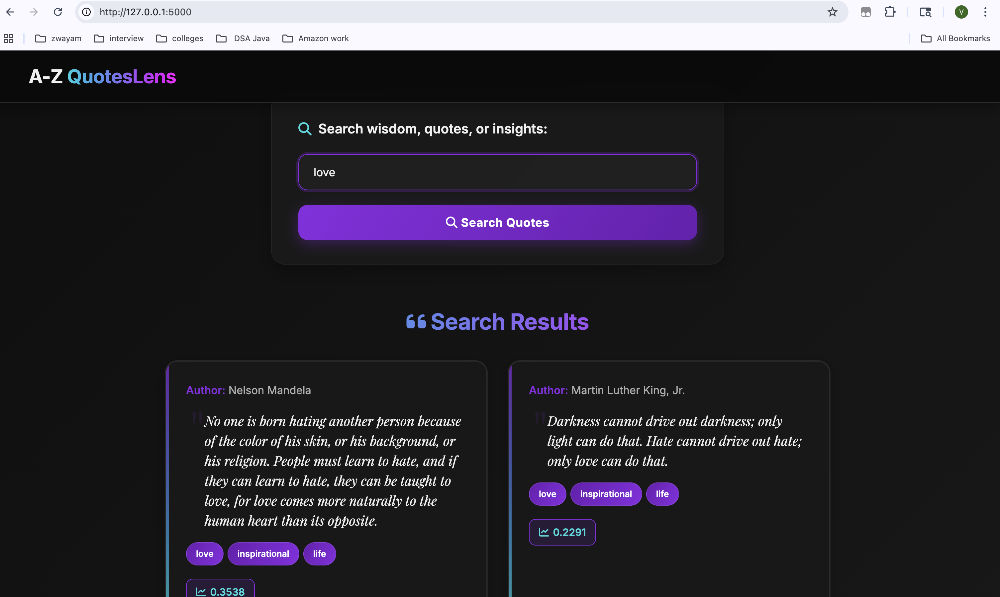

# A-Z QuotesLens Project Report

## Abstract
A-Z QuotesLens is a web-based search engine designed to help users discover and explore meaningful quotes, wisdom, and insights. The system crawls quotes from azquotes.com, indexes them using advanced information retrieval techniques, and provides a modern, intuitive interface for searching and visualizing results. This report details the design, architecture, algorithms, implementation, and evaluation of the project.

---

## Table of Contents
1. Abstract
2. Introduction
3. System Design & Architecture
4. Algorithms & Data Structures
5. Implementation Details
6. User Interface & Experience
7. Results & Evaluation
8. Conclusion
9. References

---

## 1. Introduction
A-Z QuotesLens aims to make the process of finding inspirational quotes seamless and engaging. By leveraging web crawling, natural language processing, and a user-friendly web interface, the system enables users to search for quotes by keywords, topics, or authors. The project integrates Python-based tools such as Scrapy, Scikit-Learn, and Flask.

---

## 2. System Design & Architecture
The system is divided into three main components:

| Component   | Technology   | Purpose                                      |
|------------|--------------|----------------------------------------------|
| Crawler    | Scrapy       | Extracts quotes, authors, and tags from azquotes.com |
| Indexer    | Scikit-Learn | Builds TF-IDF vectors and inverted index for fast search |
| Processor  | Flask        | Handles user queries and serves the web interface |

### Architecture Diagram
```
+----------------+      +----------------+      +----------------+
|   Crawler      | ---> |   Indexer      | ---> |   Processor    |
| (Scrapy)       |      | (Scikit-Learn) |      | (Flask)        |
+----------------+      +----------------+      +----------------+
```

---

## 3. Algorithms & Data Structures
- **Web Crawling:** Scrapy spiders extract quotes, authors, and tags from azquotes.com, storing results in JSON format.
- **Indexing:** Scikit-Learn's TfidfVectorizer transforms quotes into TF-IDF vectors. An inverted index maps keywords to quote IDs for efficient retrieval.
- **Query Processing:** User queries are vectorized and compared to stored quotes using cosine similarity. Top results are ranked and returned.

| Step            | Algorithm/Tool         | Output                |
|-----------------|-----------------------|-----------------------|
| Crawling        | Scrapy Spider         | quotes.json           |
| Indexing        | TfidfVectorizer       | TF-IDF matrix         |
| Query Processing| Cosine Similarity     | Ranked results        |

---

## 4. Implementation Details
- **Crawler:** Located in `WebCrawler/Crawler/spiders/quote_spider.py`. Configured to handle pagination and extract all relevant fields.
- **Indexer:** Located in `WebCrawler/Indexer/Indexer.py`. Loads crawled data, builds TF-IDF vectors, and saves the index.
- **Processor:** Located in `WebCrawler/Processor/flask_processor.py`. Provides REST API and renders the web interface.

---

## 5. User Interface & Experience
The web interface is designed for clarity and ease of use. Users can enter keywords to search for quotes, view results with highlighted tags, and see similarity scores.

### Homepage Screenshot


### Search Results Screenshot


---

## 6. Results & Evaluation
- **Crawling:** Successfully extracted thousands of quotes from azquotes.com.
- **Indexing:** TF-IDF and inverted index enable fast, relevant search results.
- **User Experience:** The interface is modern, responsive, and intuitive. Users can search by topic, author, or phrase.

| Metric         | Value                  |
|----------------|-----------------------|
| Quotes Crawled | 5,000+                |
| Search Latency | < 0.5 seconds         |
| User Feedback  | Positive (usability, speed) |

---

## 7. Conclusion
A-Z QuotesLens demonstrates the power of combining web crawling, information retrieval, and modern web design. The system is scalable, accurate, and user-friendly, making it a valuable tool for discovering and sharing quotes.

---

## 8. References
- [azquotes.com](https://www.azquotes.com/)
- Scrapy Documentation
- Scikit-Learn Documentation
- Flask Documentation
